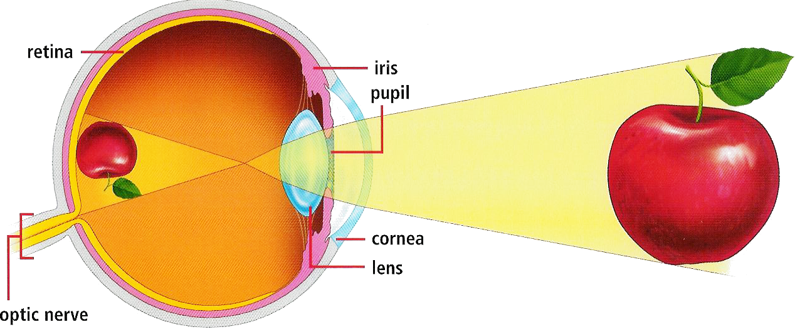
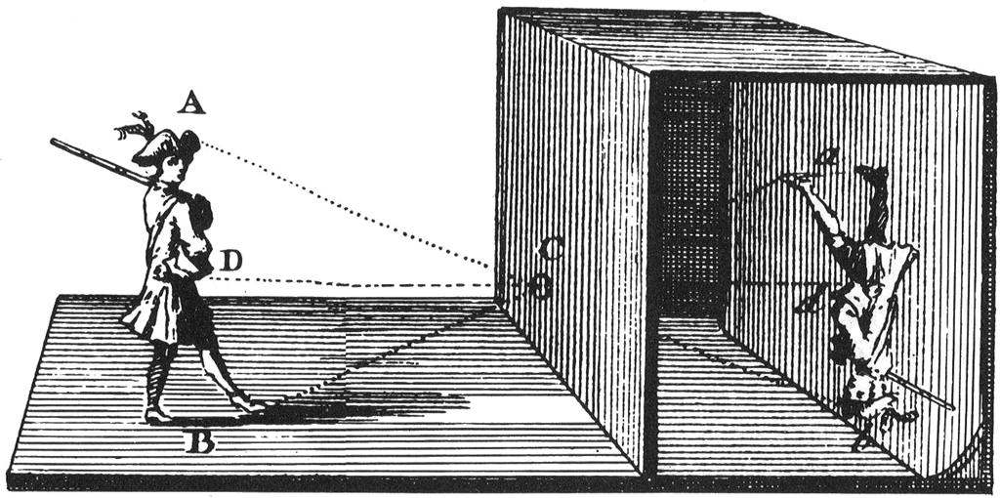

# Week 1

### Today, Wednesday 30th September 2015

1. [Welcome](#welcome) :)
* Discussion: [Ways of seeing](#ways-of-seeing)
* Team project: [EyeBombing](#team-project)  
* Workshop: [GitHub and MarkDown](#workshop)

### Your [homework](#homework) and [blog](#blog)!

# Welcome

1. [What is this course about?](../../README.md)
* [What's the plan?](../../README.md#plan) Make sure you subscribe to the [calendar feed](https://www.google.com/calendar/ical/rave.ac.uk_agop0ff7kdgdc289jdrl5021gs%40group.calendar.google.com/public/basic.ics)! 
* [What can you learn?](../../README.md#learning-goals)
* Keeping a **journal** to record your creative process is *extremely* important. Don't let your ideas and thoughts fade away! Think of your project blog as your **digital sketchbook**. More on that [here](https://github.com/RavensbourneWebMedia/Blogging#why-blogging).
* Reading lists and perusing the library (we'll also share some PDFs).
* **Peer learning**: [one of the most effective ways](http://visible-learning.org/hattie-ranking-influences-effect-sizes-learning-achievement/hattie-ranking-teaching-effects/) to learn something is to teach it to someone else. During this course you'll be sharing your skills and knowledge in class, leading mini-tutorials and moderating debates. Starting with [your homework for next week](#peer-learning-research)! 

# Ways of seeing

### Looking before creating

One of the key skills of a designer is the ability to look at what surrounds you and **see the possibilities** for how things can be *framed*. By *training your mind* to see these possibilities, you'll be able to recognise them when you're out with your camera. 

> One should not only photograph something for what it is, but also for **what else** it is.

> [Minor White](https://en.wikipedia.org/wiki/Minor_White), photographer

When you're about to snap a picture, or when browsing through images, ask yourself: 

**What else could this be?**

### How do we see? 

<!--[The Stage Theory Model](https://en.wikipedia.org/wiki/Atkinson–Shiffrin_memory_model):-->

1. **Notice**   
	
	Our senses pick up **stimuli** and pass them on to the brain. 
	
	In the case of vision, **light** enters our eyes and stimulates our **retina**. Notice how light that comes from the *top* of our vision field will make an impression at the *bottom* of our retina.
	
	The optic nerve attached to the retina transfers that *raw data* to the brain.
	
* **Make sense**  
	
	It is the brain that *flips* visual back to their natural orientation, to form *images* and **make sense** of what surrounds us.
	
	When data has entered the brain, we have the option to discard it or continue thinking about it. Information stays for about 20-30 seconds in *short-term memory* before it is either forgotten or passed on to *long-term memory*.

### What is the difference between seeing and looking?
	
You should watch the series [Ways of Seeing](https://youtu.be/XShzabEv8bM?t=2m37s) by John Berger (and/or read [the book](https://en.wikipedia.org/wiki/Ways_of_Seeing)). All the following quotes come from the book.
	
> Seeing comes before words. The child looks and recognises before it can speak.

We *see* with our eyes but we *make sense* of it with our brains. 

Looking is the result of an **active decision**. We decide what to look at and what to ignore.

> Each evening we *see* the sun set. We *know* that the earth is turning away from it. Yet the knowledge, the explanation, never quite fits the sight. 

### How does our brain make sense of the things we see?

Are these apples? How do you [know](http://courtauld.ac.uk/gallery/collection/paintings/renaissance/lucas-cranach-the-elder-adam-and-eve)?

* Habit
* Convention
* Past experiences
* Mental models
* Context
* Contrast (noticeable differences)
* Culture
* Taste

> Looking is less spontaneous and natural than we tend to believe [...] The way we see things is affected by what we *know* or what we *believe*.

<!-- > We never look at just one thing; we are always looking at the **relation between things and ourselves**. -->

<!-- > But there is also another sense in which seeing comes before words. It is seeing which establishes our place in the
surrounding world; we explain that world with words, but words can never undo the fact that we are surrounded by it. -->

### What is an *image*?

> An image is a sight that has been **recreated** or reproduced.
	
### Can you see the similarities between an eye and a camera?

Why is it called [*camera*](https://en.wikipedia.org/wiki/Camera_obscura) btw?

<!--https://commons.wikimedia.org/wiki/File:Camera_obscura2.jpg#/media/File:Camera_obscura2.jpg-->

### Do you *take* a photograph or *make* a photograph?

> Every image embodies a way of seeing. Even a photograph. For photographs are not, as is often assumed, a mechanical record. Every time we look at a photograph, we are aware, however slightly, of the photographer selecting that sight from an infinity of other **possible sights**.

### How do we create images?

* What are you looking at?
* How do you look at things?
* How do you want things to be looked at?
* What do you look like?
* What is the relationship between what you see and what you make? What you make and how you are seen?

# Team project

### EyeBombing 

This **team project** is about *looking* and *creating images*. Looking at everyday objects and our surroundings with different eyes and using **photography** to frame them, so that others can see what we want them to see.

All the project material is [here](../../projects/eye-bombing).

Today:

1. Form teams.
* Start photographing objects around Ravensbourne.
* Set up a GitHub repository for your team project.

Between today and next week:

1. Continue capturing images, both individually and as a team.
* Edit images (optional). 
* Record your creative process in your blogs.

Next week:

1. Review your work in class
* What have you made?
* How can you improve it?

Formative presentation (28.10):

1. Present your work as a team, both process and results.
* Reflect on what you learned from it.

# Workshop

### GitHub 

Check out [this handy guide](https://github.com/RavensbourneWebMedia/Guides/blob/master/how-to-git.md) on *what* Git is, *how* it works and *why* you should use it.

It boils down to a couple of things:

* **Organisation**: keeping backed up versions of your work.
* **Collaboration**: working on the same projects with many other people (*many* can mean thousands) effectively.

1. Go to [GitHub](https://github.com/) and *sign up*.
* Create an *organisation* for your project team.
* Create a *repository* for your team project (EyeBombing).
* Download and install [SourceTree](https://www.sourcetreeapp.com/): it's a free app to manage Git-based projects.
* *Clone* your project (EyeBombing) repository on your computer.
* *Add* one or more (EyeBombing) images to it. *Commit* and *push* to GitHub. 

### MarkDown

What does **marking up** mean?

> The idea and terminology evolved from the marking up of paper manuscripts: the revision instructions by editors, traditionally written with a blue pencil on authors' manuscripts.

> From [Wikipedia](http://en.wikipedia.org/wiki/Markup_language)

All your **digital texts** are marked up, whether you see the **markup** or not. That is, they contain instructions for computers to make a word **bold**, another *italic* or <u>underlined</u> and so on.

**HTML** is one of many markup languages, the one used to mark up documents (aka *hypertexts*) on the WWW.

**Markdown** lets you write using an easy-to-read, easy-to-write plain text format, then convert it to HTML.

1. Download and install [Mou](http://25.io/mou) if you're on a Mac, or [MarkdownPad](http://markdownpad.com) if you're on Windows. Alternatively, you can work on MD online using [StackEdit](https://stackedit.io).
* Read this [easy guide (3 minutes)](https://guides.github.com/features/mastering-markdown) on writing MD.
* Edit your team project (EyeBombing) **README.md** document:
	* Add all your **team members**, with at least one link (to social media profiles, personal pages, or whatever you please) per person.
	* Write a short project **blurb**, so that visitors to your GitHub repository can get what it is all about.
	* Display one or more images that you have already pushed to the repository. 
* *Commit* and *push* to GitHub.

# Homework

### Peer-learning research

8 **teams** of ~3 people each. You may want to stick to the same *EyeBombing* team.

Choose a *visual perception principle* to research and teach next week (one per team):

1. Closure
2. Symmetry
3. Figure/ground relationship
4. Connectedness 
5. Proximity
6. Continuation
7. Similarity
8. Past experience

Your presentation should be **~15 minutes** and you may include:

* Summary of main ideas
* Links, images, or videos of projects / products / things referenced in your research
* Other relevant things you've read, heard or seen
* Personal experiences

Each team should also prepare **1-2 questions for the class**. After hearing the presentations, we will have a short group discussion around these questions.

### Project 

Work on *EyeBombing* **with your team**.

### Blog 

**Individually**, write about *EyeBombing*. Reflect on the concept and document **your** thought process. You can post pictures of scribbled notes, or jot down notes digitally. It doesn't need to be fleshed out and well written. The main goal here is to record your flow of ideas, not to make it beautiful!

<!--
# TODO

- [ ] Workshop: MarkDown and GitHub
- [ ] How to document your progress (your blog as your online sketchbook / notebook)
-->