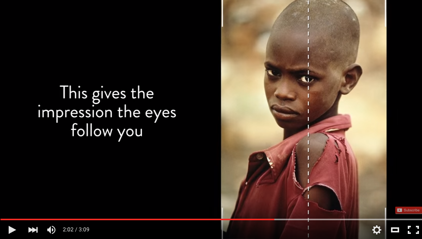
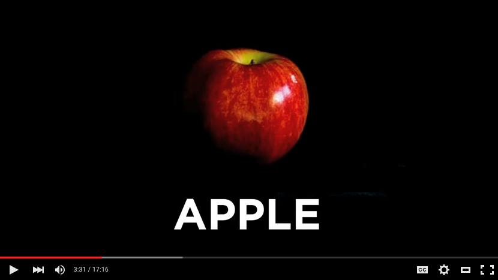
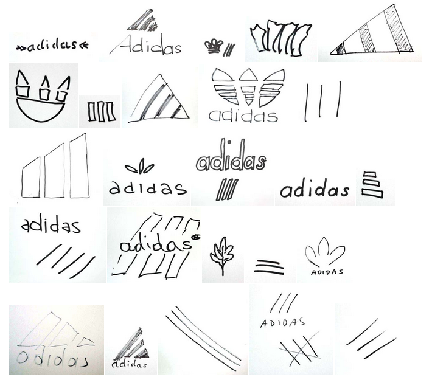
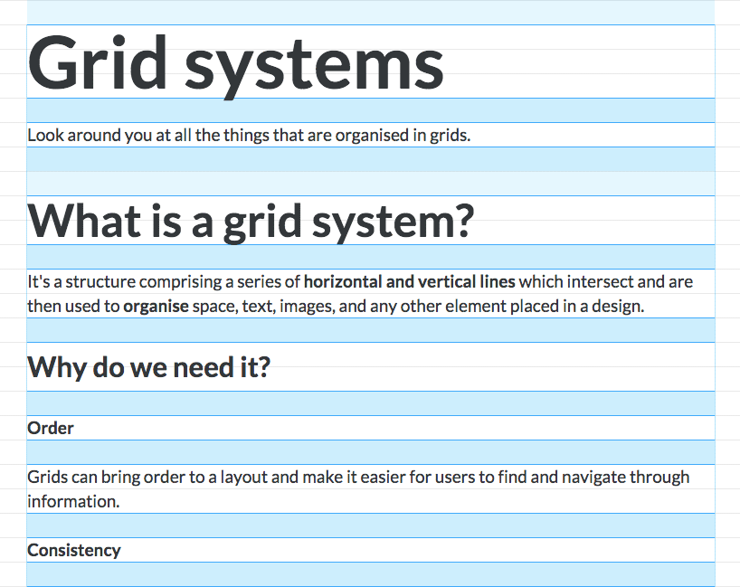

# Week 7

### Today, Wednesday 11th November 2015

1. [Debrief](#debrief): what have done so far?
* [The good, the bad and the ugly](#the-good-the-bad-and-the-ugly)
* Workshop: [gridz](#workshop)! 

### Your [homework](#homework) and [blog](#blog)

# Debrief

### EyeBombing

9 photo composition tips (featuring Steve McCurry)

### OneTweet

Interesting patterns that we observed in your projects:

* You mostly chose Ed Snowden's tweet. Why?  
 
* You overwhelmingly chose short tweets. Why?

* **Fonts** have a personality. Don't just pick one, try many!  
  
	Try and avoid using default fonts like *Myriad*, *Arial*, *Times New Roman*, *Verdana*, *Trebuchet* and *Comic Sans*.  
  
	Good online sources of fonts: 
	
	* [Font Squirrel](http://www.fontsquirrel.com/)
	* [Adobe Typekit](https://typekit.com)
	* [League of Movable Type](https://www.theleagueofmoveabletype.com/)
	* [Google Fonts](https://www.google.com/fonts)
	* [Fonts in Use](http://fontsinuse.com/)
	* [Typecast](http://typecast.com/)
	* [Typewolf](https://www.typewolf.com/)
	* [Fontstand](https://fontstand.com/)
	* [WhatFont tool](http://chengyinliu.com/whatfont.html)

* Vertical lettering: don’t do that, it’s hard to read.

* Some of you got stuck with perception principles (my fault partially).   
  
	For the final submission, explore **tweet’s meaning(s)** and play with visual **metaphors** and cultural **references**.  
  
	 

* Don't state / illustrate the obvious.

	

	In Chip Kidd's words:  
  
	> Don't treat people like morons.

### Union Hack

Touching on **branding** elements:

* **Visual grammar**: starting from one element and building lots of variations that are still recognisable as part of the same *family*.   
  
	Example: Joe's tour of the Maldives flag around the globe
	
	
	
* **Shapes**: make them simple, so that a kid could draw them.

	
	
<!--* Symbols	

* **Colours**  --> 

* **Naming**  
  
	Jatar, Floridabwe, Portniger, New Lucia :)
	
	Make sure they have no embarrassing meanings in other languages!
	
	Use [alliteration](http://robdkelly.com/blog/marketing/alliteration-examples/).
	
	Test their **memorability**.

### General observations

* Make sure you **read the brief**. Have a version that strictly follows it, and another that pushes the boundaries.

* Be prepared for tech to fail during your presentation. Have a **plan B**.

* **Rehearse** your presentation, don't wing it. 
 
* Don't expect people to know what you're talking about. 

	Have an **intro** slide/section where you *tell them what you're going to tell them*.

* Explain your process, not just the end results.   
  
	Show us how you got there.  
  
	

* *Like it / Don't like it* is not professional. It may be ok on FB, but not during a design critique. Rather say 

	> I chose this font (colour, picture, shape, xyz) **because**...

	and after *because* never use *I like it* or *it's interesting*.  
  
	

# The good, the bad and the ugly

Let's collect shitty design examples on [this Pinterest board](https://www.pinterest.com/metodb/unbelievable-visual-design).

When adding a pin, add a short explanation of *why this design sucks* and specify which visual design principles (one or more, in any order) your example doesn't follow:

- [ ] There is no *harmony* in this design, because...
- [ ] The *spacing* of elements makes me cringe, because...  
- [ ] The *hierarchy* is off, because...  
- [ ] This design is *unbalanced*, because...
- [ ] The *contrast* is bad, because...
- [ ] *Scale* is used in a weird way, because...
- [ ] The *visually dominant* element is not the right one, because...
- [ ] Elements that should be *similar* are not, because...
- [ ] The *message* is wrong, because...

<!-- https://en.wikipedia.org/wiki/Design_elements_and_principles#Principles_of_design -->

Visual Design Theory manual, by [@metodb](https://twitter.com/metodb).

# Workshop

Look around you at all the things that are organised in grids... 

### What is a grid system?

It's a structure comprising a series of **horizontal and vertical lines** which intersect and are then used to **organise** space, text, images, and any other element placed in a design.

### Pick 3 sites you like and draw their grids on paper!

Printable templates from [InterfaceSketch](http://www.interfacesketch.com)

### Why grids?

> Designers solve problems. Web designers are faced with finding solutions to visual and organisational problems and one approach to solving these problems is the grid. It’s not the only approach you might take, but it’s one with several important benefits.

From [Why grids?](http://www.vanseodesign.com/web-design/why-grids/)

#### **Order** 

Grids can bring order to a layout and make it easier for users to find and navigate through information.
	
#### **Consistency** 

Consistent layouts can help users absorb the information we’re trying to communicate (they learn where to find it, consistently) and build a sense of familiarity
	
#### **Proportion** 

Grids offer a guide to the placement of information and help generate visual hierarchy. They promote rhythm and consistency in a design and help you develop relationships between elements based on rational proportions.

#### **Efficiency** 

Grids allow designers to quickly add elements to a layout because many layout decisions are addressed while building the grid structure.

# Homework

### Blog 