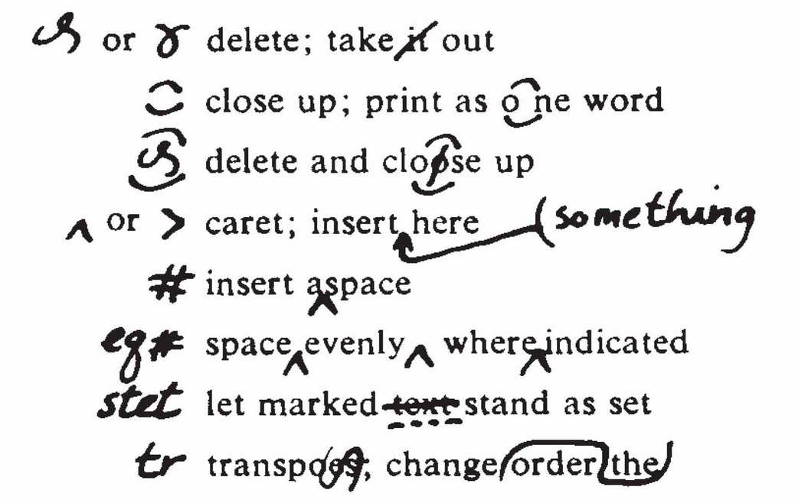

# Week 8

### Today, Wednesday 18th November 2015

1. [What is *code*?](#what-is-code) 
* [Meet HTML](#meet-html)
* There's HTML in your plate
* Meet CSS
* There's CSS in your plate 

<!-- 
- [ ] gh-pages?
-->

#### Your [homework](#homework) and [blog](#blog)

# What is **code**?

Can you fill in the blanks?

#### [...] code

Think of words/phrases that end with `code`.

<!-- *Morse code*, *post code*, *dress code*... -->

Code existed **before computers**.

Code is about

*   transmitting information
*   giving instructions
*   **communication**

If I want to talk to my **grandma**, I need to use Italian. To communicate with you, I use English. 

To **talk to a computer**, we use...

#### Code is **instructions** to a computer: extremely powerful, fundamentally thick.

### How do you learn to code?

Remember how you learned your first language as a child?

You learned your first language by copying people around you, observing their reactions to your actions.

> If I say `mum` then that one person will respond. She also responds when I cry. She doesn't respond to other names, it seems.

Learning a coding language is like **learning a new language**.

#### **Translating** your ideas into a language your computer understands

#### **Observing** how the computer responds to your inputs and adapting them until it works

**Today** you're going to learn **2 new languages**.

# Meet HTML

### `HTML` = How To Make Lunch 

#### true / false ?

> A **markup language** is a modern system for **annotating** a document in a way that is syntactically distinguishable from the text. 

> The idea and terminology evolved from the *marking up* of paper manuscripts: the revision instructions by editors, traditionally written with a blue pencil on authors' manuscripts.

> From [Wikipedia](http://en.wikipedia.org/wiki/Markup_language)

All your **digital texts** are marked up, whether you see the **markup** or not. That is, they contain both content and meta-content.

**HTML** is one of many markup languages, the one used to mark up documents (aka *hypertexts*) on the WWW. 

### `
`Hello`
`

##### `
`Hello`
`

Wanna learn all the HTML tags? [html5Doctor has a good HTML dictionary](http://html5doctor.com/element-index/).

<!--Writing HTML can be quite cumbersome ..

	<ul>
		<li>All this fuss for a bullet point</li>
	</ul>	

.. so a guy called John Gruber came up with [**MarkDown**](http://daringfireball.net/projects/markdown/) (an open-source project) to let people focus on writing, and not worry about the HTML meta-content.-->

# Homework

### Peer-learning: **CSS tricks**!

On the Google document I emailed you (you can also find it on Slack), there's a new table called **CSS tricks** for you to learn and teach next week.

Your team **mini-lesson** should be **~15 minutes** and include:

* One or more **remixable demos** of your trick on [Thimble](https://thimble.mozilla.org/)
* A quick **explanation** of your trick, preferably as an HTML5 presentation (you can use [slides.com](https://slides.com) for that)
* A **quiz** for your audience (you can use [Kahoot](https://getkahoot.com/) for that)

##### Topics: 

### Blog

Continue working on [Code in your plate](../../projects/code-in-your-plate) and blog about it:

* Write about your **design process**. What inspires you, what do you want to achieve?
* Write about your **coding process**. How are you translating your design ideas into code? What and how are you learning?