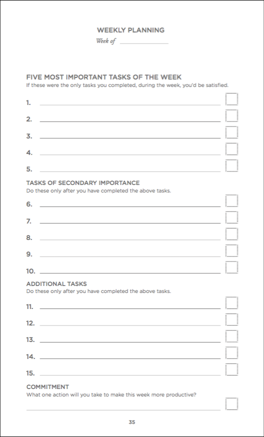

# Week 9

### Today, Wednesday 25th November 2015

1. Peer-learning: [CSS tricks](#peer-learning)
* Workshop: [Responsive Web Design](#workshop)
* [Tutorials](#tutorials) on *Code in your plate*

#### Your [homework](#homework) and [blog](#blog)


# Peer learning

### Why peer learning?

Learning from *each other, together*. It's a form of **cooperative** learning. 

In peer learning, everybody plays both the **teacher** and the **learner**.

By teaching to your peers, you reinforce your own learning. [It works](http://visible-learning.org/hattie-ranking-influences-effect-sizes-learning-achievement/hattie-ranking-teaching-effects)!

Also, you get to practice and build confidence in your **communication skills**.

### This is not a formal presentation

You're not being tested. 

You're not here to please me. 

You're here to teach to your peers and learn from them. 

You're here to practice what you'll do in your next job.

#### We're here to become *co-learners*.

### 8 teams

### 15 minutes per team

* One or more **remixable demos** of your trick on [Thimble](https://thimble.mozilla.org/)
* A quick **explanation** of your trick, preferably as an HTML5 presentation (you can use [slides.com](https://slides.com) for that)
* BONUS: **live examples** of your trick in action in other websites
* A **quiz** for your audience (you can use [Kahoot](https://getkahoot.com/) for that)

#### Tricks

1. How to use `color` and `background-color` to enhance the behaviour of elements in different states: `hover`, `focus`, `active` and `visited`. Include transparency, aka `rgba`.  
* How to style elements to look and feel like *clickable things* (usually referred to as *buttons*), including but not limited to CSS properties like `border` and `border-radius`.
* How to use `position: fixed;` to make elements stick to the page (not scroll away). 
* How to use `relative` and `absolute` `position`ing to control elements precisely (to the pixel). 
* How to centre elements horizontally, including but not limited to CSS properties like `display` and `margin: auto`.
* How to use CSS `transition`s.
* How to use animation libraries like [Animate.css](https://daneden.github.io/animate.css).  
* How to use vector icons from [Font Awesome](https://fortawesome.github.io/Font-Awesome).  


# Workshop

**Responsive Web design** means making a site that *responds* to the browser and device that it is being shown on, by looking great no matter what.

We'll make our **recipes responsive**.

You can either use a code editor like [Brackets](http://brackets.io/) or [Sublime](http://www.sublimetext.com/2), or edit your recipe online on [Thimble](https://thimble.mozilla.org/).

### *Content first*

That is, **HTML**.

1. Make / edit `index.html`
* The backbone, between `<body>` and `</body>`:

	```html
	<article class="recipe">
     <header></header>
     <section class="ingredients"></section>
     <section class="method"></section>
   </article>
   ```
* Inside `<header>`

	```html
	<h1></h1>
	<p>Serves</p>
	<p>Preparation time</p>
	```
* Inside `<section class="ingredients">`
	
	```html
	<h2>Ingredients</h2>
	<ul>
		<li><input type="checkbox"> Ingredient 1</li>
		<li><input type="checkbox"> Ingredient 2</li>
		<li><input type="checkbox"> etc.</li>
	</ul>
	```
* Inside `<section class="method">`
	
	```html
	<h2>Method</h2>
	<ol>	
		<li>
			<p>Step 1</p>
			
		</li>
		<li>
			<p>Step 2</p>
			
		</li>
		<li>
			<p>Step 3</p>
			
		</li>
	</ol>
	```	
* Fill in texts and images.	

### Let's style it

That is, **CSS**.

It's good practice to start with a solid *CSS foundation*, correcting bugs and browser inconsistencies and **resetting** the default styles.

Download [Normalize](https://necolas.github.io/normalize.css/) and link it in the `<head>` of `index.html`

```html
<link rel="stylesheet" href="normalize.css">
```

In the example above `normalize.css` is in the **same folder** as `index.html`, see `href`. If you place it somewhere else, or name it something else, you'll need to adjust the value of `href` accordingly.
	
### *Mobile first*

1. Make / edit `style.css`
* Link it in the `<head>` of `index.html` 

	```html
	<link rel="stylesheet" href="style.css">
	```
* Style images

	```css
	img {
		max-width: 100%;
	}
	```	
* Adjust horizontal paddings

	A key concept behind responsive design is fluidity and proportionality as opposed to fixed width layouts. 

	This means using **relative units** (`%` and `rem`) rather than fixed units (`px`) as much as possible.

	```css
	h1, h2, header p, ul, ol p
	{
		padding: 0 1rem;
	}
	```
* Style `ul` 

	```css
	ul {
		list-style: none; /* remove the bullet points */
	}
	```
* Style `ol`

	```css 
	ol {
		padding: 0;
		list-style-type: none;
	}
	ol li
	{
		counter-increment: item;
	}
	
	ol li p:after 
	{
		content: counter(item);
		position: absolute;
    	left: 1rem;
    	font-size: 10rem;
    	opacity: .2;
	}	
	```

<!-- -->

### Let's make it *responsive*

Now that our recipe is good for mobile screens, we can make it look proper on larger screens.

We'll use a CSS technique to target specific media and screen sizes: **media queries**.

```css	
@media (min-width: 40rem) /* this line is the query */
{
	/* if the query is true, then the following rules are applied.. */
	
	body 
	{
		max-width: 40rem;
		margin: 0 auto; /* centre it horizontally */
	}
	
	/* ..up to here */
}
```

We'll make the page look different when it's **640px wide or more**. 

* `640px` = `40rem` 
* `rem` is the `body` font-size: `16px`
* 16 * 40 = 640
* `min-width: 40rem` means `40rem wide or more`
* See common device sizes [here](https://www.browserstack.com/responsive)

### And [here's code for the finished thing](../../projects/code-in-your-plate/responsive-recipe)


# Tutorials

1. Go through the :ballot_box_with_check: [**checklist**](../10/#checklist) :ballot_box_with_check: for everything you have to hand in next week.
* Use the [Productivity Planner](https://drive.google.com/open?id=0B0FP625GojKHRlJRZWQ4cjVvSFk) to plan the final sprint!

[](https://drive.google.com/open?id=0B0FP625GojKHRlJRZWQ4cjVvSFk)

# Homework

### Prepare summative 

Tweak *all* your work in this unit so that you can **present** it next week during the *summative assessment*. 

Check the :ballot_box_with_check: [**checklist**](../10/#checklist) :ballot_box_with_check: for everything you have to hand in!

### Blog

#### `How to {YOUR CSS TRICK HERE}`

Polish up your **CSS trick demo** and write a *how to* post for anyone to learn it. 

Publish it to GitHub / Medium.

This will become part of a series of tutorials that we'll publish on the Web Media official site next year!